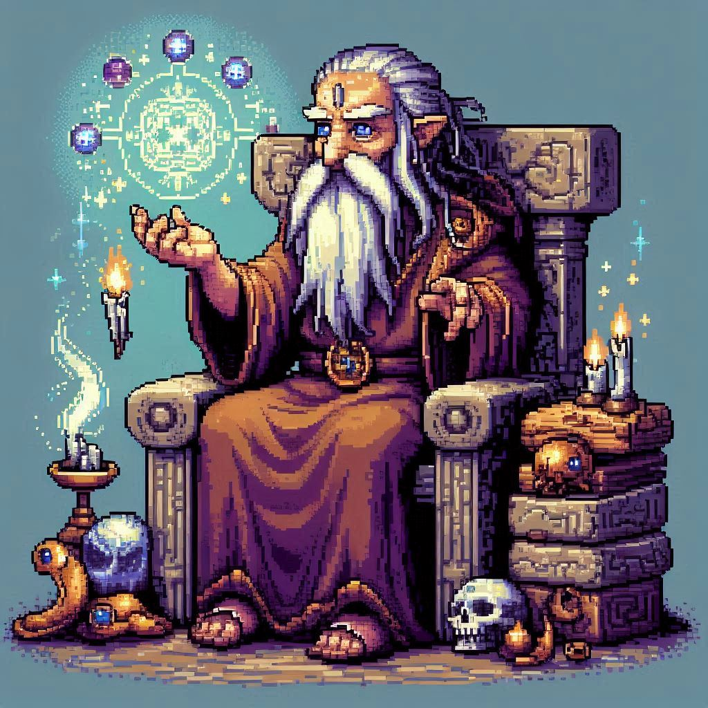

# Interactive Fantasy Game



*Ancient storyteller in a fantasy game*, made with DALL-E 3

## Due Friday, 3/28

## Overview


*Wizardry*, one of the most influential computer games of all time, via [the CRPG Addict blog](https://crpgaddict.blogspot.com/2010/02/game-5-wizardry-proving-grounds-of-mad.html)

<br/>

*Dungeons and Dragons* is the archetypal fantasy roleplaying game, where players take on the roles of adventurers exploring a fantasy world, guided by a "dungeon master" who determines the course of the story and evaluates the results of players' decisions by rolling dice. Lots of dice.

The earliest computer RPGs, like *Wizardry* (1981), borrowed heavily from the basic concepts of D n' D, with the computer taking on the role of the dungeon master. However, computer games always failed to reproduce the truly open-ended worlds of interactive tabletop RPGs, since they were limited by what the designers could code into the game.

Let's jump forward almost 40 years to 2019, when a Brigham Young University student named Nick Walton [created *AI Dungeon*](https://if50.substack.com/p/2019-ai-dungeon). *AI Dungeon* used the then-cutting-edge text generation program ***GPT-2*** to create interactive narratives that could grow and expand over time.

This project will allow you to continue experimenting with the OpenAI API by using it to write your own fantasy exploration game. You will:

- Choose the theme and setting of your game
- Give the player a starting scene
- Prompt the player to enter the action they want to take
- Use GPT to continue the story, generating the next scene or room in response to the player's action

Along the way, you'll get to practice using loops, lists, functions, and the other features we've developed so far.

## AI Usage

Beyond using the API, you can use AI tools to help you develop your ideas and code. As before, keep a log of your AI interactions and your reactions to the AI's responses, so you have a record of how your project developed.

### Warning

You can use AI in any way you want, but be careful about AI generated code for the OpenAI API. The format of the API functions has changed a few times, and some models may write code for you that uses the *older* versions. These won't work and your program will crash.

Make sure to thoroughly test your code before submitting it!


## Setup

Make a `Project_3` directory and create a file named `game.py` inside it.

## Review the basic chatbot

The starting point for this project is the basic chatbot from Lab 8. Review that code and make sure you understand how it's implemented and how to use the OpenAI API before continuing with this project.

### API key management

In the previous lab, you entered the API key into your terminal manually using the `export` command. This works, but it's annoying because you'd have to reenter the key every time you start a new terminal session.

Here's another approach to secret management. Create a file in your `Project_3` directory named `.env`
```
touch .env
```
This is the "environment" file for your project. Put the folowing inside it, then add the real API key in between the quotes:
```
# Google Search API Credentials
OPENAI_API_KEY="COPY THE REAL API KEY IN BETWEEN THESE QUOTES"
```

Filenames that start with `.` are considered **hidden files** by the shell. They aren't really invisible, but they don't show up in the output of a normal `ls` file listing command. Hidden files like `.env` are typically used for configuration.

### Updated chat code

Here's a version of the starting chat program that uses the `.env` file. It uses a Python library called `dotenv` to read the key from the file. You can install `dotenv` using the `pip` command in the terminal:
```
pip install dotenv
```
The actual chat interaction code is the same as the version in the lab:
```
"""
Calling the GPT API using a .env file to load the API key
"""

from openai import OpenAI
import os
from dotenv import load_dotenv

# Load environment variables from .env file
load_dotenv()

# Get API credentials from environment variables loaded from .env file
OPENAI_API_KEY = os.environ.get('OPENAI_API_KEY')

client = OpenAI()

# client.chat.completions.create is the basic function to submit a request
completion = client.chat.completions.create(
    model="gpt-4o-mini",
    messages=[
        {"role": "system", "content": "You are a helpful assistant."},
        {
            "role": "user",
            "content": "Write a haiku about AI."
        }
    ]
)

# Print the response
print(completion.choices[0].message.content)
```

### Picky detail: Don't upload `.env` to GitHub

At some point, you might want to upload your project to a GitHub profile as a demonstration of your work. That's fine, but **make sure you don't upload the `.env` file with the key inside it**.

OpenAI will detect if a key shows up in a public repo and, if so, disable the key so it can't be used illicitly. I'd then have to make another key, distribute it, etc.

GitHub allows to make a special `.gitingore` file that can list files you don't want to commit to your repo. You can read more about that strategy if you're interested in posting your project code.


## Guidelines


<br/>

This project is intentionally open-ended. You can choose the setting, themes, etc. based on your interests. If you want to choose something other than a [Standard Fantasy Setting](https://tvtropes.org/pmwiki/pmwiki.php/Main/StandardFantasySetting), you can do that.

Your program should use a `while` loop that repeatedly generates and displays the next scene of the story and prompts the player. The player enters an action and then the game generates the next output. Keep track of the history of the conversation, like in the basic chatbot.

Think about how to prompt GPT. You may need to supply some additional information, in the system prompt or as part of the request, to get it to do what you want.

### Original feature

I want you to add **at least one original feature** to your program that goes beyond the core chat interaction framework. Some ideas:

- Pre-scripted narrative events that occur randomly
- Combat against monsters (or other mini-games) that are triggered randomly, like in a standard computer RPG
- Maintaining a list of items that you can find and then use
- Stats, levels, skills, etc.
- Changing the prompt that goes to the AI over time to change the tone/theme/setting of the game as the player advances
- Modeling a decay of the player's sanity by raising the model temperature

These are just suggestions and you can choose whatever you want, but I want you to be **ambitious** and creative.

## Submission

Submit your `game.py` file and your log of AI interactions to Canvas.

Note that I need the **actual Python script** as a .py file, not a copy of your code pasted into another document.
